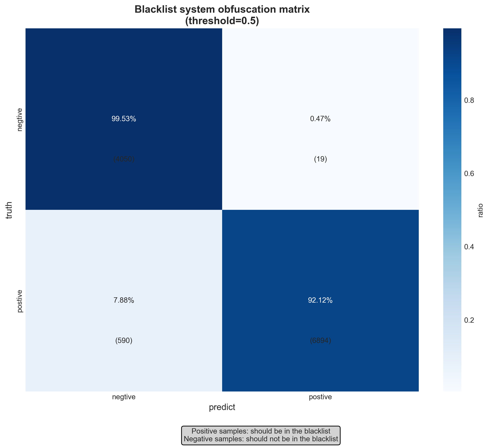
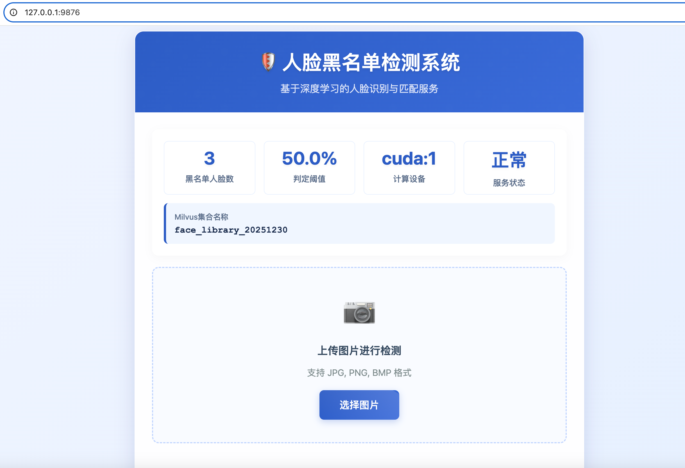
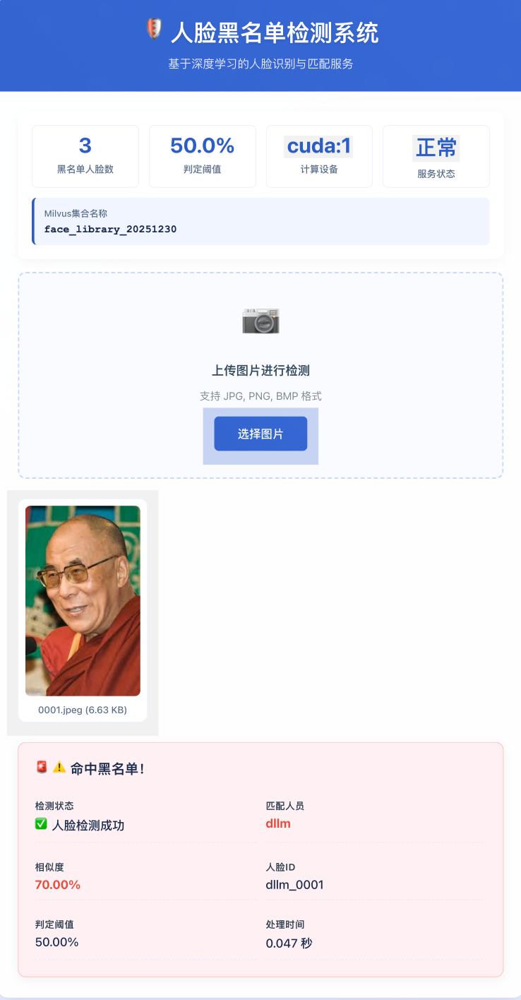

# 构建人脸库黑名单并实现基于黑名单的人脸识别拦截

使用流程如下：

## conda环境

使用environment.yml文件生成FaceSafety环境，conda activate激活该环境

## milvus数据库

使用milvus-docker目录下的docker-compose文件拉取docker镜像，已经针对国内网络问题替换了docker源
注意该版本使用的是gpu版本的milvus，如果需要cpu版本，需要去https://github.com/milvus-io/milvus/releases 官网获取对应的docker-compose文件

## 数据

数据我们采用的是kaggle上的开源数据集来实验。
需要去https://www.kaggle.com/datasets/jessicali9530/lfw-dataset?resource=download 下载并解压替换archive文件夹

build_blacklist.py用于对该数据集建立黑名单人脸库（只出现一次的人脸直接进测试集，出现一个人多张人脸图片的情况，则将第一张图片进入黑名单人脸库其他图片则作为测试集使用）
evaluate.py用于验证测试集上的效果，对于正负样本分别的拦截情况

以下是实验数据正负样本的混淆矩阵

## 真实应用

在真实场景中需要真实图片来进行应用，首先使用build_new_face_library.py脚本将Input/20251230_01目录中的真实人脸图片构建为新的黑人脸库（根据需要替换掉该文件夹中的图片即可）

为了方便测试，将测试过程封装为FastAPI的服务，只需要./start_service.sh即可将服务部署在9876端口，前端页面如下：

上传图片后可以检测该人物是否出现在人脸库中，效果如下：

当人我们的人脸检测接口并不只提供一种形式的服务，实际上我们提供三种形式的文件上传方式：

### 通过图片路径检测 (/detect)
直接传入图片的绝对路径进行检测
curl -X POST "http://127.0.0.1:9876/detect" \
  -H "Content-Type: application/json" \
  -d '{
    "image_path": "/mnt/data4/dcr/测试图片/嫌疑人张三_001.jpg"
  }'

### 通过文件上传检测 (/upload)
使用 multipart/form-data 格式上传图片文件
curl -X POST "http://127.0.0.1:9876/upload" \
  -F "file=@/mnt/data4/dcr/测试图片/嫌疑人李四_002.jpg"

### 通过Base64编码检测 (/detect_base64)
传入Base64编码的图片数据，支持纯Base64和Data URI格式
使用纯Base64（需要先编码）
base64_image=$(base64 -w 0 /mnt/data4/dcr/测试图片/未知人员_003.jpg)

curl -X POST "http://127.0.0.1:9876/detect_base64" \
  -H "Content-Type: application/json" \
  -d "{
    \"image_base64\": \"$base64_image\",
    \"filename\": \"unknown_person.jpg\"
  }"
